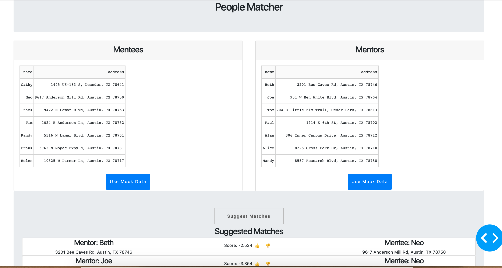

# People Matcher

A web app that allows loading csv files about people in different parties (e.g. mentors vs. mentees), and suggest matches.



## Requirements

- Docker.
- Docker-compose.

## Quick Start

```
./scripts/start.sh
```

## Unit Test

```
./scripts/test.sh
```

## TODO

- Add continuous model training for recommending matches.
